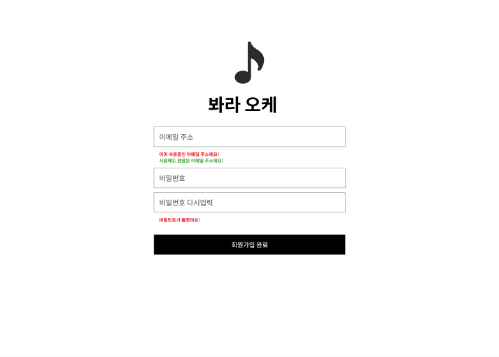
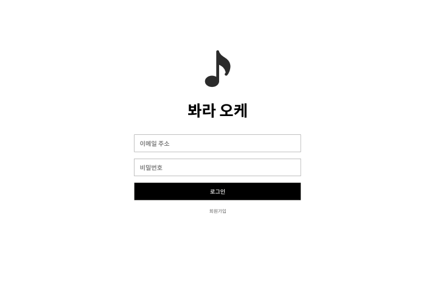
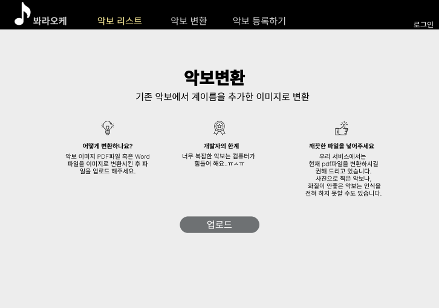
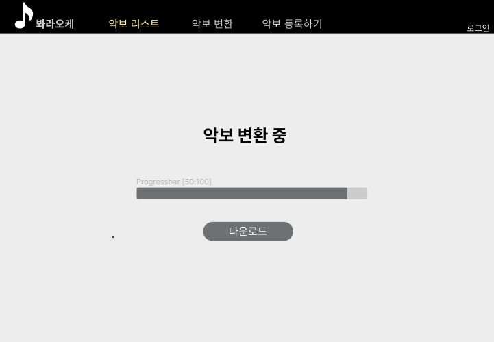
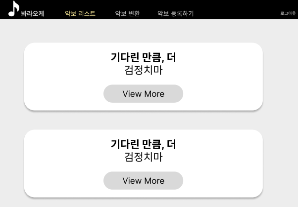
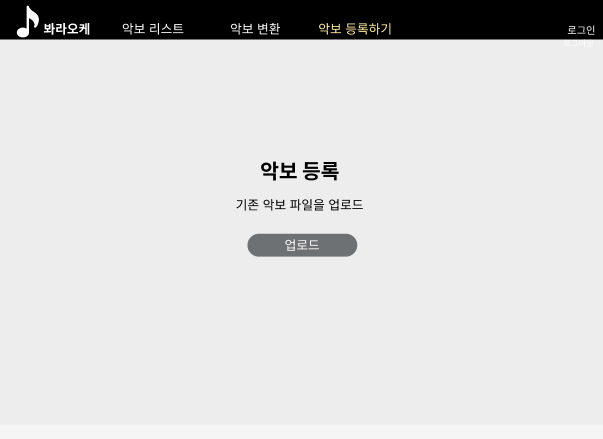

<!--Header-->
# 1. Project
- Project name : **SheetmusicList**
- Develop Period : *2022/09/17 ~ 2022/10/07*
---
# 2. Project Info
- Auth | ( 회원가입 & 로그인 )
- Server Deployment | ( AWS )

---
# 3. Team Member
**team member in charge** | **Role**

**BackEnd Team**

- [김승범](https://github.com/daily1313) | AWS
- [오정환](https://github.com/poll9999) | AWS
- [박상혁](https://github.com/baksakcci) | AWS
- [김태수](https://github.com/kimtaesoo99) | Spring Security + JWT + CRUD + AWS
- [엄태인](https://github.com/eom-tae-in) | Spring Security + JWT + CRUD + AWS
---
# 4. Skill
- JWT + Security (Json Web Token)
- CRUD (Create, Read, Update, Delete)
- TCP (Transmission Control Protocol) + CIA (Confidentiality, Integrity, Availability) + RSA + RFC
- yml
- JWT Filter
- Docker, Docket-compose
- MySQL
---
# 5. Progress
| **Completed** |
```text
1. Project Init | 프로젝트 초기화
2. Project Preferences | 프로젝트 환경설정
3. 여기는 구현한 기능 작성

```
| **Incomplete** |
```text
< Implement >
1. 여기는 구현해야할 기능 작성
```
---
# 6. Convention
| **Git Convention** |
```text
Git Convention
feat : 기능추가
fix : 버그 수정
refactor : 리팩토링, 기능은 그대로 두고 코드를 수정
style : formatting, 세미콜론 추가 / 코드 변경은 없음
chore : 라이브러리 설치, 빌드 작업 업데이트
docs : 주석 추가 삭제, 문서 변경
```
# 7. 피그마

회원가입


로그인 


악보 변환 화면


악보 변환 진행 중 화면


악보 리스트 페이지


악보 등록 화면
